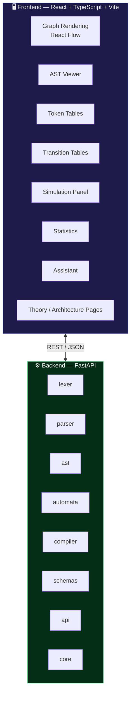
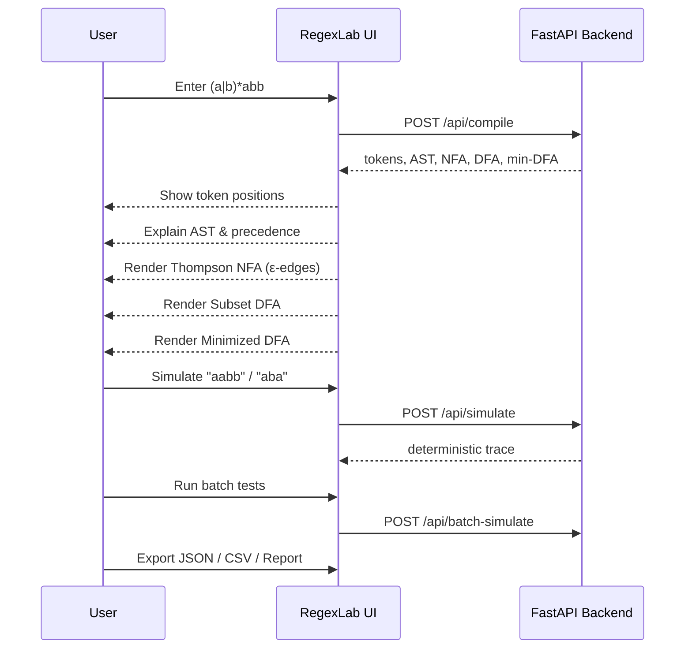

<div align="center">


<h3>Turn a regex into tokens, an AST, an NFA, a DFA, and a minimized DFA — visually.</h3>

<p>
  
  
  
  
</p>

<p>
  
  
  
  
  
</p>

<p>
  
  
  
  
  
</p>

<p>
  
  
  
</p>

<a href="#-quick-start">Quick Start</a> •
<a href="#-architecture">Architecture</a> •
<a href="#-supported-syntax">Syntax</a> •
<a href="#-api">API</a> •
<a href="#-demo-flow">Demo</a> •
<a href="#-testing">Testing</a>

</div>

<br/>

## Overview

**RegexLab** is a full-stack compiler-design laboratory for regular expressions — not a generic regex tester. It compiles a pattern through every classical stage of a regex engine and exposes each intermediate artifact in the UI, so it works equally well as a **teaching tool** and a **portfolio project**.

```
Regex → Lexer → Parser → AST → Thompson NFA → Subset DFA → Hopcroft Min-DFA → Simulation
```

<br/>

## 🏗 Architecture

```mermaid
flowchart LR
    A["📝 Regex String"] --> B["🔤 Lexer\n(Tokenizer)"]
    B --> C["🌳 Recursive-Descent\nParser"]
    C --> D["🌲 Abstract Syntax\nTree (AST)"]
    D --> E["🔀 Thompson\nConstruction (NFA)"]
    E --> F["⚡ Epsilon Closure +\nSubset Construction"]
    F --> G["🎯 DFA"]
    G --> H["✂️ Partition Refinement\n(Minimization)"]
    H --> I["✅ Minimized DFA"]
    I --> J["▶️ Deterministic\nSimulation"]

    style A fill:#6366F1,color:#fff,stroke:#4338CA
    style D fill:#8B5CF6,color:#fff,stroke:#6D28D9
    style E fill:#EC4899,color:#fff,stroke:#BE185D
    style G fill:#F59E0B,color:#fff,stroke:#B45309
    style I fill:#22C55E,color:#fff,stroke:#15803D
    style J fill:#06B6D4,color:#fff,stroke:#0E7490
```



### System layers



<br/>

## ✨ Features

| | |
|---|---|
| 🔍 **Full pipeline visibility** | Inspect tokens, AST, NFA, DFA, and minimized DFA for any regex |
| 🎨 **Interactive automata graphs** | React Flow rendering with START/ACCEPT notation, self-transitions, fit/zoom/reset/fullscreen |
| 🧪 **Simulation lab** | Single and batch string testing with deterministic step traces |
| 📊 **Stats & export** | Export results as JSON, CSV, and a full compilation report |
| 🤖 **Optional AI assistant** | Falls back to deterministic local suggestions — the core compiler never depends on an external AI service |
| 🐳 **One-command deploy** | Docker Compose + Nginx, CI-tested on every push |

<br/>

## 📐 Supported Syntax

RegexLab targets **regular languages**, not engine-specific pattern tricks.

| Category | Supported |
|---|---|
| Literals & concatenation | `abc`, implicit concatenation |
| Alternation / grouping | <code>&#124;</code>, `(...)` |
| Quantifiers | `*`, `+`, `?` |
| Bounded repetition | `{m}`, `{m,n}`, `{m,}` (capped at 100) |
| Epsilon | `ε`, `epsilon` |
| Character classes | `[...]`, ranges, negated ASCII classes, `.` |
| Shorthand classes | `\d` `\D` `\w` `\W` `\s` `\S` |
| Escapes | `\xHH`, `\uHHHH`, escaped metacharacters |
| Anchors | `^`, `$` |

**Intentionally excluded:** backreferences, lookarounds, conditionals, recursion, and other zero-width engine-specific constructs — these fall outside regular-language automata and would break the FAANG-style compiler semantics this project demonstrates.

<br/>

## 🚀 Quick Start

### Backend

```bash
cd backend
python -m venv .venv
source .venv/bin/activate      # Windows: .venv\Scripts\Activate.ps1
pip install -r requirements.txt
uvicorn app.main:app --reload --port 8000
```
API docs → `http://localhost:8000/docs`

### Frontend

```bash
cd frontend
npm install
npm run dev
```
App → `http://localhost:5173`

### Docker (full stack)

```bash
docker compose up --build
```
App → `http://localhost:8080`

<br/>

## 🔌 API

| Method | Endpoint | Description |
|---|---|---|
| `GET` | `/api/health` | Health check |
| `POST` | `/api/compile` | `{ "regex": "(a\|b)*abb" }` → full pipeline artifacts |
| `POST` | `/api/simulate` | `{ "regex": "a+", "text": "aaa" }` → step-by-step trace |
| `POST` | `/api/batch-simulate` | `{ "regex": "a+", "strings": ["a", "aa", "b"] }` |
| `POST` | `/api/assistant` | Optional — deterministic local fallback without credentials |

<br/>

## 🎬 Demo Flow



1. Open `(a|b)*abb`
2. Compile → show token positions
3. Explain the AST and operator precedence
4. Open the Thompson NFA → point out epsilon edges
5. Open the DFA → explain epsilon closure and subsets
6. Open the minimized DFA → explain partition refinement
7. Simulate `aabb` and `aba`
8. Run batch tests
9. Export JSON, CSV, and a compilation report
10. Show **Theory**, **Architecture**, `PROJECT_REPORT.md`, and `VIVA.md`

<br/>

## ✅ Testing

```bash
make backend-test
make backend-check
cd frontend && npm test -- --run
cd frontend && npm run lint
cd frontend && npm run build
```

Backend coverage includes valid syntax, malformed syntax, shorthand classes, escaped operators, bounded repetition, anchors, wildcard matching, determinism, and minimized-automata correctness. CI runs Python tests, compilation checks, frontend build, and frontend tests on every push.

<br/>

## 🎯 Product Direction

RegexLab is built as a **compiler-design workbench**, not a generic regex tester. The primary journey is:

**Regex → Lexer → AST → Thompson NFA → Subset DFA → Hopcroft Min-DFA → Simulation**

The automata workspace features explicit START/ACCEPT notation, readable transition labels, dedicated self-transition rendering, state inspection, fit/zoom/reset/fullscreen controls, a legend, and a validation lab for single and batch inputs.

See [`DESIGN_RESEARCH.md`](./DESIGN_RESEARCH.md) for the full product and UX rationale.

<br/>

<div align="center">

### ⭐ If this project helped you understand automata theory, consider starring it!


</div>
